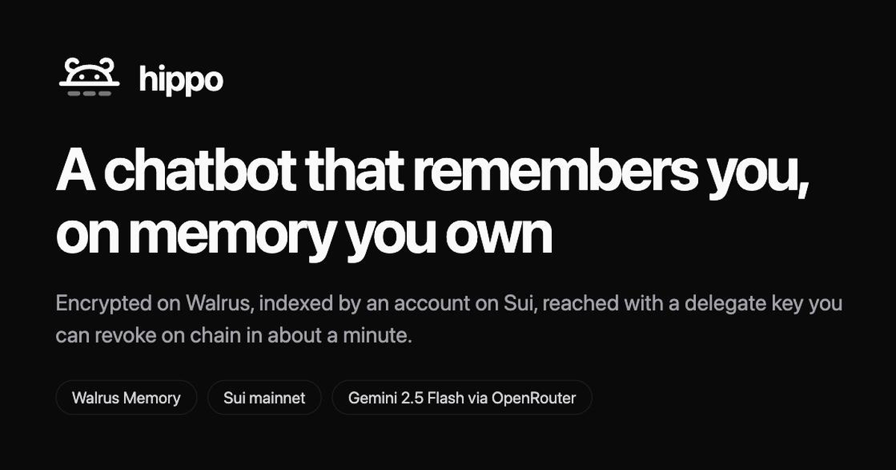

<p align="center">
  
</p>

<h1 align="center">hippo</h1>

<p align="center">
  A chatbot that remembers you across the web, Telegram, Discord, Slack and a CLI,
  where <b>you own the memory</b>: it lives in your own Walrus Memory account on Sui
  mainnet and hippo is a delegate you can revoke in one transaction.
</p>

<p align="center">
  <a href="https://hippo-web-ten-nu.vercel.app"><b>Live app</b></a> ·
  <a href="https://t.me/walrussession8_bot"><b>@walrussession8_bot</b></a> ·
  <a href="https://suiscan.xyz/mainnet/object/0x5a257802b4881641b49ea3ad3e460a4387f9262b4f96fd68cd4be3928e5a07aa"><b>The account on Sui</b></a>
</p>

---

## See it work in three clicks

1. Open the [live app](https://hippo-web-ten-nu.vercel.app) and click a starter,
   for example *"I only use pnpm, and I want short answers in Vietnamese."*
2. Click **Reload, then ask what it knows**. The page reloads and the question is
   waiting.
3. Press Send.

The conversation is gone, so nothing in the page can be answering. Whatever
comes back came back from Walrus. Transcript of that run:
`docs/evidence/three-click-demo-2026-09-23.md`.

Built for Walrus Session 8, "Chatbots That Remember".
Primary model: `google/gemini-2.5-flash` through OpenRouter on the Vercel AI SDK,
with `qwen/qwen3.7-flash` as a fallback. Both chosen by measuring them against
the project's own eval, not by reputation: `docs/evidence/model-bakeoff-2026-09-23.md`.

## Why this is different

Most memory bots keep your memory in the vendor's account. hippo starts that way
too, in guest mode, because asking for a wallet before the first message is a bad
trade. Then `/connect` moves it: one sponsored transaction registers hippo's
delegate key on a Walrus Memory account that belongs to your wallet. From then on

- `/disconnect` removes that key on chain, and within about a minute hippo
  cannot read or write anything of yours. Measured, not assumed: the relayer
  refused a removed key after 32 seconds and still accepted it at 15
  (`docs/evidence/revocation-2026-09-22.md`). hippo also destroys its own copy
  of the key, which closes that window immediately,
- the same memory should be readable from Claude Code, Cursor or any other Walrus
  Memory client you sign in with the same wallet. That follows from how the
  account works; the Claude Code check itself needs a spare wallet and has not
  been run yet (`docs/BLOCKERS.md`),
- `/proof` shows the Walrus blobs behind any answer,
- `/export`, or Export on `/me`, hands you the memory as a file: every blob, and
  its text checked line by line against the fingerprint hippo recorded when it
  wrote it. What the file cannot do yet is let you decrypt the blobs without the
  relayer, and it says so (`docs/evidence/export-2026-09-24.md`).

It also keeps up when you change your mind. Say you moved from pnpm to bun and
the correction is stored, recalled next to the fact it replaces, and believed;
`bun run demo` fails if any answer states the old value
(`docs/evidence/conflicts-2026-09-24.md`).

The web app makes that concrete rather than claiming it. `/me` reads your
`MemWalAccount` straight off Sui and shows the account, its owner and every
delegate key the contract will honour, with hippo's own marked, next to a button
that revokes it. The memory list filters by type, and searching reads the words
back from Walrus, because the text is never stored in Postgres.

## Run it

You need Node 20 or later, Bun 1.3.14 and Docker for the local Postgres. Credentials are a Walrus Memory
delegate key and an OpenRouter API key; see [Credentials](#credentials).

```bash
cp .env.example .env         # fill the four blanks listed below
bun install
bun run smoke --write        # one memory round trip on mainnet
```

The four blanks in `.env` are `MEMWAL_PRIVATE_KEY`, `OPENROUTER_API_KEY`, and
`SESSION_SECRET` and `KEY_ENCRYPTION_KEY`, one `openssl rand -hex 32` each. With
your own Walrus Memory key, also replace `MEMWAL_ACCOUNT_ID`, which ships set to
hippo's account. Leave everything else as it is; blank values mean "off".

`smoke --write` stores one fact and recalls it. It writes the same fact every
time, so from the second run on it reports that an earlier run already stored it
and writes nothing, which is the dedupe every chat write goes through.

Start the whole local stack in one terminal:

```bash
bun run dev                  # Postgres + schema + API + web, managed by Turbo TUI
```

Turbo's TUI shows the server and web logs together. Postgres is started in the
background by Docker Compose. Press `q` or Ctrl+C to stop Turbo; stop Postgres
with `docker compose down` when you are done. If :5173 is taken, Vite moves to
:5174, which the server also accepts.

Other useful commands, in another terminal when needed:

```bash
bun run hippo                 # CLI, its own person until you /link it to web
bun run demo                  # memory eval; about 5 minutes
```

`bun run diagnose` is the first thing to run when something looks wrong: it prints
what is configured, what works, and where the chain and the relayer disagree.

`bun run demo` is the proof. It teaches hippo five things, then contradicts one of
them, throws the conversation away, and in a fresh session asserts four things:
that it recalls the facts, that the correction wins over the fact it replaced
even though both are recalled, that a `style` memory changed the reply language
without being asked again, and that a second channel recalls the same facts. It
then asks the same questions with memory off, and fails if those answers know
anything nobody could guess; that is the before and after, measured. It also
prints what memory costs per turn (`docs/evidence/latency-2026-09-24.md`).

`bun run evidence` prints the numbers the session's submission form asks for,
counting only memories that actually landed on Walrus. `bun run restore` checks the
relayer's index against what we wrote.

Three more exist and are easy to miss. `bun run evidence:daily` is the one to use
during the real-use week: it points at production explicitly and writes a dated
file, where plain `bun run evidence` reads whichever database `.env` names and would
quietly record your own test chatter instead. It opens with `bun run ops`, what went
wrong in production over the last day (failed and stuck writes, dropped and
given-up recalls, failed turns and commands, crashes), counted from
`memory_index` and Railway's logs without printing a word of anyone's memory.
`bun run capacity` reads the model budget, the database size and the relayer
against a week of real use, and says whether it fits. `bun run prune:people`
clears rows for people who never said anything.

`bun run lint`, `bun run typecheck` and `bun run test` need no credentials at all; tests
that read the real account skip themselves without them. `bun run db:push` needs
only the database. `bun run smoke` needs the Walrus Memory credentials, and
`bun run demo`, `bun run hippo` and the chat also need `OPENROUTER_API_KEY`.

The clean-clone log in `docs/evidence/clean-clone-2026-09-25.md` predates this
Bun migration. The Bun install, lint, typecheck, tests, build and OSV scan have
been rerun against this workspace; run `bun run dev` from a terminal with Docker
running to start the local app.

### Credentials

Create an account and a delegate key at [memory.walrus.xyz](https://memory.walrus.xyz)
with the wallet you want to own the operator account.

`MEMWAL_ACCOUNT_ID` is the **MemWalAccount object id**, not your wallet address
and not the delegate public key. All three are `0x` plus 64 hex and they are easy
to confuse. If you have the delegate key and nothing else:

```bash
bun run packages/memory/scripts/find-account.ts
```

It prints the owner address, the account id and the delegate public key, which is
what the submission form calls `MEMWAL_AGENT_ID`.

### Channels

Each adapter starts only when its token is present, so you can run with none of
them. `docs/PLAN.md` has the setup for each one; Slack is a single paste of
`docs/slack-manifest.yaml`, and Discord's slash commands are one command
(`bun run --filter @hippo/server discord:commands <guildId>`).

## Layout

```
apps/web         Vite + React + Tailwind v4 + shadcn/ui, dapp-kit wallet flow
apps/server      Hono API + Telegram / Discord / Slack adapters, one process
packages/core    agent loop, prompts, remember and recall tools, the eval
packages/memory  Walrus Memory client, memory format, dedupe, recall policy, limiter
packages/db      Drizzle schema
docs/            brief, idea, architecture, plan, spikes, evidence, bug reports
```

`docs/ARCHITECTURE.md` explains guest and owned mode and lists every limitation
we measured, `docs/SPIKES.md` records what we measured on mainnet and what it
changed (including a hypothesis we had to retract), `docs/issues/` holds thirteen
bug reports drafted against Walrus Memory, each re-run on 2026-09-25 (nine still
stand; the rest are marked with what became of them), and
`docs/evidence/security-review-2026-09-21.md` is an adversarial review of this
repo with its findings fixed.

Three limits worth knowing before you rely on this. A memory can be made
unrecallable but not deleted. The relayer's `restore()` does not currently
re-index this account, so treat the search index as the fragile part and Walrus
as the durable one. And an owner cannot yet decrypt their own memory without the
relayer: mainnet ciphertext is sealed by a committee SEAL key server whose
aggregator requires an API key. Access control is genuinely on chain, and we
measured that revoking a delegate key stops the relayer within about 32 seconds
(`docs/evidence/revocation-2026-09-22.md`), but reading the bytes yourself still
goes through a service. All three are written up in `docs/issues/`.

## Troubleshooting

**Read this one before anything else: there are two Walrus Memory deployments
live on mainnet.** They are separate packages, not one upgraded in place. The
documentation names one; `GET /config` serves the other. Take the package id
from `/config`, because the documented one is stale, and it is very easy to take
the registry id from the documentation at the same time and end up straddling
both. `/config` does not return a registry id, so nothing stops you.

Two failures come out of that and neither of them mentions a registry. Sponsored
transactions return `502 {"code":"sponsor_upstream_error"}`, which looks exactly
like an outage on their side. And resolving an owner returns a real, active
account with real delegate keys that simply is not yours, so a config that
verifies cleanly can still be wrong. We lost a week to the second one and drafted
a bug report accusing the relayer of ignoring on-chain access control before
finding the cause.

`bun run diagnose` now fails when the chain and the relayer disagree, which is what
catches this. If you configure an object id by hand, check its Move **type**, not
just that it resolves: the registry for the current package is typed under the
current package. Written up in `docs/issues/11`.

**`401` from the relayer.** Almost always one of four things, and `bun run diagnose`
tells you which: the delegate private key is wrong, the key is not registered on
the account, `MEMWAL_ACCOUNT_ID` names something other than the account object,
or staging credentials are pointed at the mainnet relayer. Note that a wrong
account id *works* on mainnet, because the relayer repairs it by scanning the
registry, and fails on testnet, where that scan is unavailable. So a config that
looks fine can be wrong; run `bun run diagnose`.

**"I set `MEMWAL_ACCOUNT_ID` and it still says the wrong account."** The account
id is the `MemWalAccount` object id, not your wallet address and not the delegate
public key. All three are `0x` plus 64 hex.
`bun run packages/memory/scripts/find-account.ts` prints all three,
correctly labelled, from the delegate key alone.

**Staging versus mainnet.** Credentials are per-deployment. A key created on
`staging.memory.walrus.xyz` will not authenticate against
`relayer.memory.walrus.xyz`, and the error is a bare `401` either way.

**`recall` returns nothing for a namespace that has memories.** Two causes.
Either the namespace does not match what was written, since namespaces are exact
strings with no normalisation and `my-app` and `My-App` are different buckets, or
you have hit the relayer bug where an empty result comes back with a non-zero
`dropped_count`. hippo retries that four times; if you are calling the SDK
directly, check for the field. See `docs/issues/01`.

**A memory was saved but `/memory` does not list it.** Writes take about
25 seconds and land in the background. `memory_index` holds the row immediately
with status `pending`; look there for a `failed` row and its error.

**The bot went quiet on every channel at once.** The adapters share one process,
so one crash takes them all down. Check the server logs.

## Deploy

`docs/DEPLOY.md` has the step by step: Neon for the database, Railway for the
server, Vercel or Walrus Sites for the web app, with every environment variable
and the three things that will bite you. The image is verified by building and
running it, not just by building it.

The server is a long-running process, not serverless, because the chat adapters
hold gateway connections and memory writes finish in the background.
